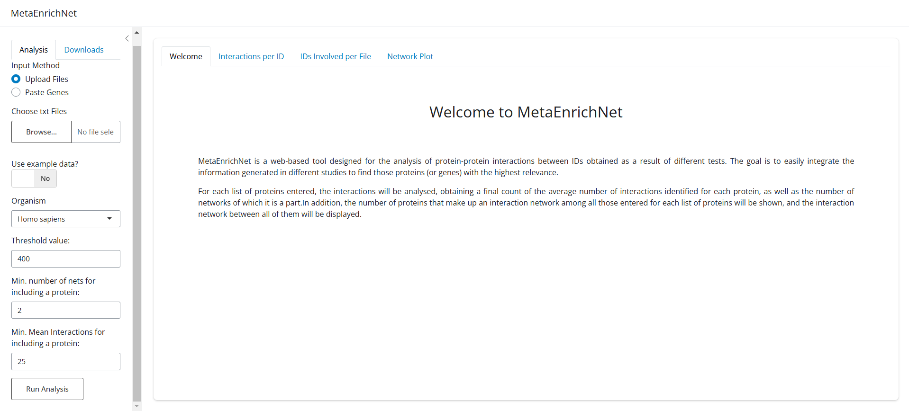

# MetaEnrichNet

 

**MetaEnrichNet** is an interactive web-based `Shiny` application that allows the user to combine results from different omics studies to analyse protein-protein interactions obtained from [STRING database](https://string-db.org/). It aims to easily integrate multiple gene/protein lists to find the consensus between all of them based on their protein-protein interactions.

We seek to bring bioinformatics analysis closer to all users in a simple, fast and efficient way.

## Table of Contents

1.  [How the App Works](#how-the-app-works)
    1.  [Load Gene Data](#load-gene-data)
    2.  [Set Parameters](#set-parameters)
    3.  [Run Analysis](#run-analysis)
    4.  [Visualize Results](#visualize-results)
    5.  [Export Results](#export-results)
2.  [Running MetaEnrichNet Locally](#running-metaenrichnet-locally)
    1.  [Requirements](#requirements)
    2.  [Installation](#installation)
    3.  [Running the App](#running-the-app)

## How the App Works

The main interface of the programme has a left sidebar divided into two tabs: Analysis, which contains the tool's parameters, and Downloads, which allows downloading files.

In addition, it has four main windows:

-   Welcome: the initial tab containing a brief description of the tool.
-   Interactions per ID: shows the average number of interactions and the number of networks involved for each gene/protein.
-   IDs involved per File: shows the number of proteins that are part of a network out of the total number of genes/proteins initially contained in each list.
-   Network Plot: shows a graph of interactions between the proteins in the different lists entered.

#### 1. Load Gene Data

The loading of the lists of genes/proteins to be integrated can be carried out in two ways:

-   **Upload `.txt` files**: the tool allows the user to directly upload as many `.txt` files as the user wishes to integrate. These files must contain a set of *Gene Symbol* identifiers distributed by lines (one identifier per line). Nothing should be included inside the file beyond the *Gene Symbol* identifiers (no column header is necessary).

-   **List pasting**: alternatively, you can paste the gene lists directly into the text field provided in the tool. This is done by pasting one *Gene Symbol* identifier per row, separating the identifiers of different lists using the characters `###`. Nothing more than the *Gene Symbol* identifiers should be pasted, it is not necessary to add a name to each list, as the program will internally already assign the `List_<n>` identifier to each gene/protein list.

In order to observe how the tool works, an example dataset can be used. This set consists of four `.txt` files (*GSE10072.LCvsNormal, GSE19188.LCvsNormal, GSE63459.LCvsNormal, GSE75037.LCvsNormal*) containing Gene Symbol corresponding to genes overexpressed in lung cancer samples obtained in four different studies.

#### 2. Set Parameters

 - **Organism**: organism to which the identifiers entered in the gene/protein lists belong. The tool is able to handle data from human (*Homo sapiens*), mouse (*Mus musculus*) and *Escherichia coli*.
 - **Threshold value**: evidence score that STRING will use as a quality filter to determine which protein-protein interactions are considered in model building. Higher Threshold values imply more evidence and will be more restrictive.
 - **Minimum number of nets for including a protein**: minimum number of networks in which a protein must be involved in order to be considered in the total protein graph.
 - **Minimum Mean Interactions for including a protein**: minimum number of average interactions a protein must have to be considered in the total protein graph.

#### 3. Run Analysis

After setting the parameters of the tool, the analysis has to be run by clicking on the *‘Run Analysis’* button. **The analysis may take a few moments**, especially if it is the first time the tool is run, as it has to build the STRING model. After completion of the analysis, the *‘Interactions per ID’* window will be displayed automatically.

#### 4. Visualize Results

MetaEnrichNet returns 3 results, available in each of the windows:

 - **Interactions per ID**: represents the number of networks in which a protein is present (the maximum being the total number of files entered) and the average number of interactions that protein has per network. It allows us to know which proteins are the most frequently repeated and to identify possible hubs.
 - **IDs involved per File**: represents the number of proteins involved in the network versus the total number of possible proteins for each list of identifiers. In this way it is possible to know which file is the most informative.
 - **Network Plot**: representation of the interaction network obtained with STRING by considering all the proteins of all the files that meet the requirements of the minimum number of networks and the minimum number of interactions specified in the parameters. Allows for visual identification of possible hubs or superclusters. The network is interactive, so that nodes can be moved and even selected to obtain more information about them, obtained directly from the STRING database.
 
Two additional buttons are included within the *Network Plot* window. The first button, *‘Show Network’*, allows the network to be displayed when pressed. The second, *‘Update Network’*, allows you to update the proteins that are considered in the network after modifying the parameters, thus avoiding having to perform the analysis again. After updating the network, it is necessary to activate the *‘Show Network’* button again for the network to be displayed.

#### 5. Export Results

From the *Downloads* tab you can download the results in different formats:

 - `.tsv`: tab-separated text, available for *Interactions per ID* and *IDs involved per File* results.
 - `.csv`: comma-separated text, available for *Interactions per ID* and *IDs involved per File* results.
 - `.txt`: white space-separated text, available for *Interactions per ID* and *IDs involved per File* results.
 - `.html`: available for *Network Plot* results. The downloaded file can be opened in a browser and interacted with the network, as well as opened directly in STRING using the hyperlink available inside it.

## Running MetaEnrichNet Locally

### Requirements

The tool was developed with `R` version `4.4.2`, so a compatible version is required. It is also advisable to have the RStudio IDE installed, to facilitate the execution of the tool,  as well as the following libraries:

 - `shiny` v 1.10.0
 - `shinyjs` v 2.1.0
 - `bslib` v 0.8.0
 - `dplyr` v 1.1.4
 - `DT` v 0.33
 - `ggplot2` v 3.5.1
 - `shinycssloaders` v 1.1.0
 - `shinyWidgets` v 0.8.7
 - `shinyBS` v 0.61.1

### Installation

No installation beyond those described in the Requirements section is necessary. It is enough to download the `MetaEnrichNet_app.R` script and its attached files.

### Running the App
> [!TIP] If you are using **RStudio**, you can click the `Run App` option to run the app in its built-in browser.

For running MetaEnrichNet, just go to the folder containing the script and run the following command in your console:

`R -e "shiny::runApp('MetaEnrichNet_app')"`

The app will open in your default web browser, allowing you to start your analysis.
